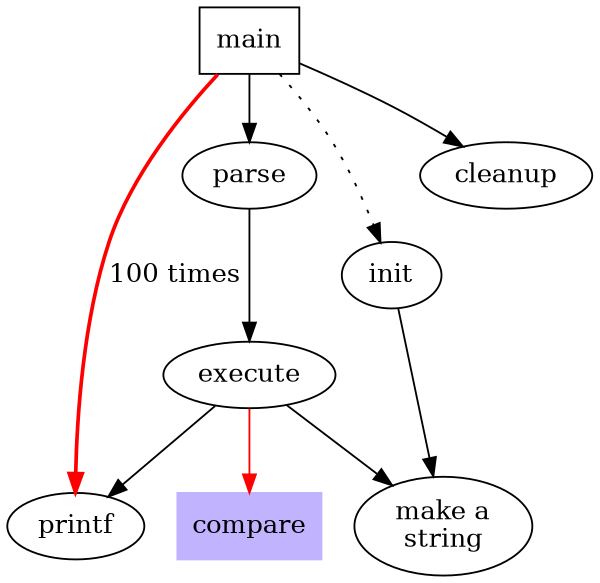

#Web Markdown 查看工具

这是一个在Web上查看Markdown的工具

* 支持语法高亮
* 支持graphviz绘图

如果需要使用graphviz需要单独安装它

语法高亮跟github是同一格式

```go
    func main() {
        log.Pinttln("test");
    }
```

把graphviz文件存成.dot文件然后直接当成图片引入就可以了。



上面的脚本会显成这张图：


