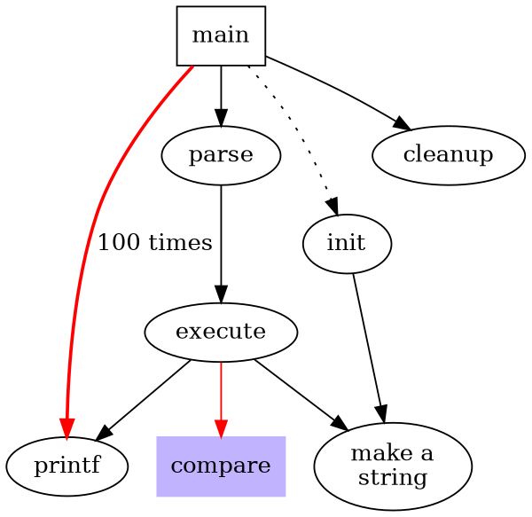

#markdown test

test

test | test1
-----|------
sss|sss
bbb|bbb

```go
func main() {
    log.Pinttln("test");
}
```

```php
/**
 *  则试类
 */
class aa
{
    public function bb()
    {
        echo "is bb";
    }
}
$tmp = new aa();
$tmp->bb()
```



由上面代码生下此图

<dot>
digraph G {
    size="4,4";
    main [shape=box]; /*注释*/
    main -> parse [weight=8];
    parse -> execute;
    main -> init [style=dotted];
    main -> cleanup;
    execute -> {make_string; printf}
    init -> make_string;
    edge [color=red];
    main -> printf [style=bold,label="100 times"];
    make_string [label="make a\nstring"];
    node [shape=box, style=filled, color=".7 .3 1.0"];
    execute -> compare;
}
</dot>

